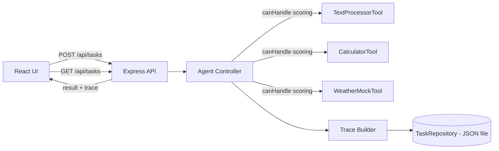

# Delivery Plan — Agentic Task Runner (BMO Coding Challenge)

**Timeline:** 2 days
**Team:** 1 person wearing three hats — Product Owner, Business Analyst, Developer
**Cloud budget:** Azure credits available (optional, not required for the core deliverable)
**Guiding principle from the brief:** *"do not over-engineer" / "we are not looking for perfection; we are looking for sound engineering judgement."*

That last line is the actual brief. Everything below is written to optimize for **"looks like a senior engineer made deliberate trade-offs under a deadline,"** not "looks like a side project that grew forever." Every choice has a one-line reason next to it — if I can't justify a piece of tech in one sentence, it doesn't go in.

---

## 1. Product Owner view: what we're actually building and why we're cutting scope

### 1.1 The product in one sentence
A small web app where a user types a task in plain language, an "agent" decides which internal tool can handle it, runs the tool, and shows the user both the answer and a transparent step-by-step trace of *how* it got there — with history you can revisit later.

### 1.2 MoSCoW — what's in for 2 days

| Priority | Item | Reasoning |
|---|---|---|
| **Must** | 3 tools (Text, Calculator, Weather-mock) | Explicitly required, graded directly |
| **Must** | Rule-based Agent Controller that picks a tool | This *is* the "Agent Thinking" score |
| **Must** | Execution trace (steps, tool used, timestamp) | Explicitly required, graded directly |
| **Must** | API: submit task → get result + trace | Explicitly required |
| **Must** | JSON-file persistence of task history | Cheapest option that satisfies the requirement |
| **Must** | React UI: input → result → history → trace inspector | Explicitly required |
| **Must** | README with run instructions, assumptions, time spent | Explicitly required deliverable |
| **Should** | Basic error handling (bad input, unmatched tool, tool failure) | Graded under "appropriate error handling" |
| **Should** | Unit tests on tools + agent selection logic | Graded under "tool abstraction and testability" |
| **Could** | Multi-step tasks (chain two tools) | Listed bonus, cheap to add once agent is generic |
| **Could** | Deploy to Azure for the demo video | Not asked for, but credits exist and it's a nice "wow" if time allows |
| **Won't (this round)** | LLM-based tool selection (Azure OpenAI) | Real "agentic reasoning" upgrade, but non-deterministic + adds latency/cost/failure surface right before a deadline. Documented as the #1 "next step" instead. |
| **Won't** | SQLite / real DB | Explicitly optional; JSON file is simpler, zero setup, equally valid per the brief |
| **Won't** | Docker | Explicitly bonus; skip unless everything else is done with time to spare |
| **Won't** | Auth / RBAC | Explicitly bonus, no product need for a single-user demo |
| **Won't** | Real weather API | Brief explicitly says mock — pulling in a real API adds a dependency/failure point for zero grading benefit |

**BA note tying this back to the source doc:** every "Must" row above maps 1:1 to a bullet in the Requirements/Evaluation Criteria sections of the challenge PDF. Nothing in "Must" is a guess — see the traceability table in §2.3.

### 1.3 Non-goals (explicitly, so we don't drift)
- Not building a general-purpose agent framework (no LangChain-style plugin marketplace).
- Not optimizing for scale, concurrency, or multi-tenant use.
- Not chasing pixel-perfect UI — usable and clean beats "designed."

---

## 2. Business Analyst view: requirements → user stories → acceptance criteria

### 2.1 User stories

| # | Story | Acceptance Criteria |
|---|---|---|
| US1 | As a user, I can type a task and submit it | Input is non-empty on submit; disabled submit while a request is in flight |
| US2 | As a user, I see the final result clearly | Result renders distinctly from the trace; loading and error states are visible |
| US3 | As a user, I can see past tasks | A list of previous tasks (task text + timestamp + short result) is visible without reloading |
| US4 | As a user, I can inspect how the agent got an answer | Clicking a history item (or the current result) expands a numbered list of steps, the tool used, and a timestamp |
| US5 | As a developer, I can add a new tool without touching the agent's core logic | New tool = new file implementing one interface + one line of registration |

### 2.2 Agent behavioral spec (plain language → what must happen)

```
Input: "convert HELLO to lowercase"
 → Agent parses intent → matches TextProcessorTool (lowercase operation)
 → Tool executes → "hello"
 → Trace: 4 steps recorded
 → Response: { output: "hello", tools_used: ["TextProcessorTool"], steps: [...], timestamp }

Input: "what's 12 * 7"
 → Agent matches CalculatorTool
 → Tool executes → 84

Input: "weather in Ottawa"
 → Agent matches WeatherMockTool
 → Tool executes → mocked payload for "Ottawa"

Input: "asdkjhaskjdh"
 → Agent finds no confident match
 → Response: output = "I couldn't determine a suitable tool for this request",
   trace still recorded (this is itself a valid, gradable trace — not a crash)
```

### 2.3 Requirement traceability (challenge doc → build item)

| Challenge requirement | Where it's satisfied |
|---|---|
| Front-end: input/submit/result/history/inspect steps | React app, §4.4 |
| Backend API accepts task → Agent Controller → Tool → returns output/steps/tools/timestamp | Express API, §4.2–4.3 |
| Agent: parse → choose tool → execute → structured trace | `AgentController.run()`, §5 |
| 3+ tools | `TextProcessorTool`, `CalculatorTool`, `WeatherMockTool`, §5.3 |
| Persistence (SQLite/JSON/in-memory+export) | JSON file store behind a repository interface, §4.5 |
| Execution trace shown clearly in UI | Trace viewer component, §4.4 |
| README with run steps, deps, assumptions, time, improvements | Delivered alongside code (separate from this planning doc) |

---

## 3. Developer view: architecture decisions and the reasoning behind each

### 3.1 Language & stack: TypeScript end-to-end (Node/Express backend, React frontend)

**Why one language for both sides, in 2 days:**
- Zero context-switching cost between backend and frontend — matters when the clock is the constraint, not the tech.
- Shared types (e.g. the `TaskResult`/`ExecutionStep` shape) can literally be the same `.ts` file imported by both sides — one source of truth instead of two schemas drifting apart.
- TypeScript's static typing catches the exact class of bug an agent/tool-router system is prone to (wrong shape passed to the wrong tool) at compile time instead of during a live demo.

**Why not Python (`app.py`), even though the brief's example command suggests it's an option:**
The brief gives Python as *an example* of a valid run command, not a requirement — React on the frontend already forces a Node toolchain, so a Python backend would mean maintaining two runtimes for one small app. Not worth it for the time budget.

**Why Express over a heavier framework (NestJS, etc.):**
NestJS gives you DI containers, decorators, module boundaries — genuinely nice, but its ceremony is designed for teams and long-lived codebases. For a 2-day, single-file-per-concern build, a thin layered Express app (`routes → controller → agent → tools → repository`) gets the *same* separation-of-concerns credit on the rubric ("Architecture clarity and modularity") without the setup tax.

**Why Vite + React over Create React App:**
CRA is effectively unmaintained; Vite's dev server starts in milliseconds and needs almost no config — again, this is a "spend the 2 days on the actual requirements, not the scaffolding" decision.

### 3.2 Persistence: JSON file behind a repository interface (not SQLite)

The brief explicitly says *"only basic persistence is required"* and lists JSON as an equally valid option to SQLite. Given that:
- A JSON file has **zero setup** (no schema, no migration, no driver) — pure time saved.
- To still score well on *"extensibility of the agent and tool layer"* and not paint us into a corner, persistence is written behind a small `TaskRepository` interface (`save`, `getAll`, `getById`) with a `JsonFileTaskRepository` implementation. Swapping to SQLite later is a one-file change, not a rewrite — this is the trade-off documented in the README's "what I'd improve" section rather than something we build now.

### 3.3 Agent Controller: deterministic rule-based routing (not an LLM call)

This is the single most important architectural decision, so it gets its own reasoning:

**Chosen approach:** keyword/pattern matching per tool (each tool exposes a `canHandle(input): confidence score`; the agent picks the highest-confidence match above a threshold).

**Why not call an LLM (e.g. Azure OpenAI) to pick the tool**, even though we have Azure credit and it would look more "AI-native":
1. **Determinism for grading.** A reviewer will run this multiple times with the sample inputs from the brief (`"Convert to uppercase"` etc.). A rule-based router gives the same trace every time; an LLM call introduces variance right when consistency matters most.
2. **Zero external dependency risk.** An API key, network call, or rate limit failing during a live review is a worse outcome than a slightly "less AI" router that always works.
3. **It still satisfies the spec.** The brief says *"model agent-style decision logic"* — a scored, multi-tool, confidence-based router **is** agentic reasoning; it doesn't require an LLM to be "agentic," it requires observable parse → decide → act → report steps, which this gives us.
4. **It's the correctly-labeled stretch goal.** This exact upgrade (LLM-based intent classification using Azure OpenAI) is called out explicitly in §7 as the top "next step with more time" — so the thinking is documented, just not risked into the core deliverable.

### 3.4 Tool abstraction

Every tool implements the same shape, which is what makes the system extensible (a graded criterion) and unit-testable in isolation:

```ts
interface Tool {
  name: string;
  description: string;
  canHandle(input: string): number;      // 0–1 confidence this tool matches
  execute(input: string): ToolResult;     // deterministic, no side effects beyond its own logic
}
```

Adding tool #4 later = one new file + one line in the tool registry. No changes to the agent, API, or frontend.

### 3.5 Styling: plain CSS / minimal Tailwind, no component library

A UI library (MUI, Chakra) would look more "finished" in 20 minutes, but pulls in a dependency and a learning/config curve neither of which is needed to satisfy *"straightforward, usable frontend UI."* Plain, clean CSS keeps the bundle and the setup small.

---

## 4. System design

### 4.1 High-level architecture



### 4.2 API contract

| Method | Path | Purpose |
|---|---|---|
| `POST` | `/api/tasks` | Submit a new task; body `{ input: string }`; returns the full task record (see 4.6) |
| `GET` | `/api/tasks` | List all past tasks (history), newest first |
| `GET` | `/api/tasks/:id` | Fetch one task's full detail, including trace |
| `GET` | `/api/tools` | (nice-to-have) List available tools + descriptions, for UI transparency |

### 4.3 Backend folder structure

```
backend/
  src/
    agent/
      agentController.ts       # parse -> select tool -> execute -> build trace
      toolRegistry.ts
    tools/
      tool.interface.ts
      textProcessorTool.ts
      calculatorTool.ts
      weatherMockTool.ts
    storage/
      taskRepository.interface.ts
      jsonFileTaskRepository.ts
      data/tasks.json
    api/
      routes.ts
      taskController.ts
    types/
      task.ts                  # shared shape, also imported by frontend build if monorepo
    server.ts
  tests/
    tools/*.test.ts
    agent/*.test.ts
```

### 4.4 Frontend structure

```
frontend/
  src/
    components/
      TaskForm.tsx              # US1
      ResultPanel.tsx           # US2
      HistoryList.tsx           # US3
      TraceViewer.tsx           # US4 (shared by ResultPanel + history detail)
    api/
      tasksClient.ts            # fetch wrapper
    App.tsx
```

**UI flow:** `TaskForm` submit → optimistic "loading" state → `ResultPanel` shows output + a "view steps" toggle rendering `TraceViewer` → new entry appears at the top of `HistoryList` → clicking any history entry re-renders the same `ResultPanel`/`TraceViewer` for that past task (fetched via `GET /api/tasks/:id`, or just kept in local state from the initial history load — implementation detail, not a design risk).

### 4.5 Data model

```ts
interface ExecutionStep {
  step: number;
  description: string;       // e.g. "Selected tool: CalculatorTool"
}

interface TaskRecord {
  id: string;
  input: string;
  output: string;
  toolsUsed: string[];
  steps: ExecutionStep[];
  timestamp: string;         // ISO 8601
  status: "success" | "no_match" | "error";
}
```

### 4.6 Example response (mirrors the brief's own example almost exactly)

```json
{
  "id": "task_0007",
  "input": "Convert to uppercase: hello",
  "output": "HELLO",
  "toolsUsed": ["TextProcessorTool"],
  "steps": [
    { "step": 1, "description": "Received input: \"Convert to uppercase: hello\"" },
    { "step": 2, "description": "Evaluated 3 tools, selected TextProcessorTool (confidence 0.92)" },
    { "step": 3, "description": "Executed TextProcessorTool -> \"HELLO\"" },
    { "step": 4, "description": "Returning result to user" }
  ],
  "timestamp": "2026-08-07T14:02:33.000Z",
  "status": "success"
}
```

---

## 5. Agent Controller — decision logic in detail

### 5.1 Selection algorithm
1. Normalize input (lowercase, trim).
2. Ask every registered tool for a confidence score via `canHandle(input)`.
3. Pick the highest score if it clears a minimum threshold (e.g. `0.4`); otherwise return a `no_match` status with a trace explaining why (still a valid, inspectable trace — this matters for the "error handling" grading criterion).
4. Execute the winning tool inside a try/catch; a thrown error becomes a `status: "error"` trace step, not a 500 with no explanation.
5. Build the `ExecutionStep[]` array as the algorithm goes (not reconstructed after the fact) — this keeps the trace honest and is what "real" agent tracing looks like.

### 5.2 Example `canHandle` heuristics (kept intentionally simple and readable)

| Tool | Matches on |
|---|---|
| CalculatorTool | Presence of digits + an operator (`+ - * / x times plus minus`), or regex `/\d+\s*[\+\-\*\/]\s*\d+/` |
| TextProcessorTool | Keywords: `uppercase, lowercase, capitalize, word count, reverse, trim` |
| WeatherMockTool | Keyword `weather` (+ optionally extracts a city name after "in") |

Simple, but transparent and 100% unit-testable — which is exactly what's being graded, versus a black-box scoring model that would be *harder* to demo confidently in 2 days.

### 5.3 The three required tools

| Tool | Operations | Notes |
|---|---|---|
| `TextProcessorTool` | uppercase, lowercase, word count, reverse | Pure string functions, trivial to test |
| `CalculatorTool` | `+ - * /`, simple two-operand expressions | Parse via regex, not `eval()` — **never `eval` user input**, that's an unnecessary security smell even in a mock tool |
| `WeatherMockTool` | Returns a deterministic fake payload (`{ city, tempC, condition }`) seeded by city name so the same city always returns the same mock reading | No network call, so it can't fail in a demo |

### 5.4 Stretch: multi-tool chaining (bonus, Could-have)
If time remains: allow the agent to detect an input like `"what's 5 + 3, then convert the result to uppercase"` and run two tools in sequence, appending both to the trace. This is a natural extension of the same interface — no architecture change needed, which is exactly why it's listed as a *Could* and not a *Must*: it's cheap **if** the core is solid, and skippable if it isn't.

---

## 6. Step-by-step execution plan

Two 8-hour days, timeboxed. The order is deliberate: **backend + agent + tools + tests are the graded core and come first; the UI wraps a working API on day 2**, so that if day 1 overruns, we still have a demo-able backend behind a curl command rather than a pretty UI with nothing real behind it.

### Day 1 — Backend, Agent, Tools, Persistence

| Time | Task |
|---|---|
| 0:00–0:45 | Repo init, TS config, ESLint/Prettier, folder skeleton, first commit |
| 0:45–1:30 | `Tool` interface + `ToolRegistry`; stub `server.ts` + health check route |
| 1:30–3:00 | Implement all 3 tools (`Text`, `Calculator`, `Weather`) + unit tests for each |
| 3:00–4:30 | `AgentController`: scoring loop, threshold logic, trace construction |
| 4:30–5:15 | Unit tests for agent selection (including the `no_match` and `error` paths) |
| 5:15–6:15 | `TaskRepository` interface + `JsonFileTaskRepository`, wire into agent flow |
| 6:15–7:15 | Express routes (`POST/GET /api/tasks`, `GET /api/tasks/:id`, `GET /api/tools`) |
| 7:15–8:00 | Manual API testing via REST client/curl against the brief's example inputs; commit; write API notes for tomorrow's frontend work |

**End-of-day-1 exit criterion:** I can `curl -X POST /api/tasks -d '{"input":"Convert to uppercase: hello"}'` and get back the exact shape in §4.6, and history persists across a server restart.

### Day 2 — Frontend, Integration, Tests, Docs, Polish

| Time | Task |
|---|---|
| 0:00–0:45 | Vite + React scaffold, API client wrapper, basic layout/shell |
| 0:45–1:45 | `TaskForm` + `ResultPanel` wired to `POST /api/tasks`, loading/error states |
| 1:45–2:45 | `HistoryList` wired to `GET /api/tasks` |
| 2:45–3:45 | `TraceViewer` (numbered steps, tool badge, timestamp) shared between result and history detail |
| 3:45–4:30 | End-to-end pass through every sample input from the brief; fix integration bugs |
| 4:30–5:15 | CSS pass — spacing, empty states, disabled/loading states, mobile-reasonable layout |
| 5:15–6:00 | Backend + frontend error-handling audit (bad JSON, empty input, network failure) |
| 6:00–6:45 | README.md: run instructions, deps, assumptions/trade-offs (pulling straight from §3 of this doc), time spent, "what I'd improve" (pulling from §7 below) |
| 6:45–7:30 | Buffer — pick ONE stretch item only if everything above is done: multi-tool chaining *or* Azure deploy for the video, not both |
| 7:30–8:00 | Final smoke test on a clean clone (`git clone` → `npm install && npm start`), record the optional walkthrough video if time allows |

**End-of-day-2 exit criterion:** every bullet in the brief's "Deliverables" and "Requirements" sections has a visible, working counterpart; README is accurate for someone who has never seen the code.

---

## 7. Azure credits — how (and how much) to use them

Given the time box, Azure is treated as **enhancement, not dependency** — the app must run with plain `npm install && npm start` per the submission instructions, with zero Azure requirement. Two optional uses, ranked:

1. **Deployment for the demo video (higher value, lower risk):** Azure Static Web Apps (frontend, free tier) + Azure App Service or a Container App (backend). This costs an hour, does not touch core logic, and turns "clone and run locally" into "also here's a live link" for the optional walkthrough — a nice-to-have polish item, not a scored requirement.
2. **Azure OpenAI for smarter tool selection (higher wow-factor, higher risk):** exactly the upgrade described in §3.3 as *not* built into the MVP. If Day 2 finishes early, this is the most interesting thing to spend leftover time on — but as an **additive, toggleable mode** (`AGENT_MODE=rule|llm` env var) that falls back to the deterministic router, so a flaky API key or rate limit never breaks the core demo.

If neither fits in the remaining time, both are written up in the README's "what I'd improve with more time" section instead — which is itself an explicitly graded deliverable, so documenting the trade-off is not a lesser outcome than building it.

---

## 8. Testing strategy

Rubric explicitly grades *"tool abstraction and testability"* and *"execution trace quality"* — so tests target exactly those two things, not blanket coverage:

- **Unit tests, tools:** each tool's `execute()` against known inputs/outputs (e.g. `CalculatorTool.execute("3 + 5") === 8`).
- **Unit tests, agent:** given a fixed set of inputs, assert (a) the correct tool is selected, (b) the trace has the expected step count/shape, (c) an unmatchable input returns `no_match` instead of throwing.
- **No frontend test suite** unless everything else finishes early — a couple of Jest/RTL smoke tests for `TaskForm` and `TraceViewer` would be the first addition if there's slack, but this is explicitly the corner cut for time (documented in README, not hidden).

---

## 9. Risks & mitigations

| Risk | Mitigation |
|---|---|
| Day 1 backend runs long, squeezing frontend time | Backend/agent/tools are the graded core; UI can be minimal-but-functional if squeezed — priority order in §6 protects this |
| Rule-based matcher misclassifies an ambiguous input during a live demo | Threshold + explicit `no_match` trace turns a wrong guess into a transparent, explainable "I'm not confident" — which is itself good agent behavior, not a bug to hide |
| JSON file corruption on concurrent writes | Single-user demo scope makes this a non-issue; noted as a known limitation for the README rather than solved with file-locking we don't need yet |
| Azure deploy eats time better spent on requirements | Explicitly sequenced last, after everything required is done (§6, §7) |

---

## 10. Definition of Done (mirrors the brief's own Evaluation Criteria, §ing back to it deliberately)

- [ ] All "Must" items from §1.2 implemented and manually verified against the brief's own example (`"Convert to uppercase"` → `HELLO`, 4-step trace)
- [ ] 3 tools + agent selection covered by unit tests, all passing
- [ ] History and trace inspection both usable from the UI, not just the API
- [ ] `git clone` → documented single command → running app, verified on a clean checkout
- [ ] README covers run steps, deps, assumptions/trade-offs, time spent, future improvements
- [ ] Every cut corner (SQLite, LLM routing, Docker, auth, multi-tool) is a *documented decision* in the README, not a silent gap
