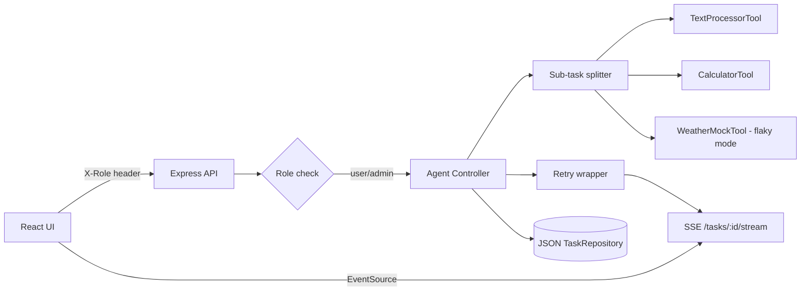

# Agentic Task Runner

> The project is evolving into a local-first, text-only French study tutor. The
> original task-runner tools are still available while the new lesson workflow
> is developed incrementally.

A full-stack task runner built for a coding challenge. You type a task in plain language into a chat-style interface; a deterministic agent scores every registered tool against the input, executes the best match, and shows you an inspectable, step-by-step trace of exactly how it decided.

## Run locally

Requires Node.js 24+.
```bash
npm install
npm start
```

Open [http://localhost:5173](http://localhost:5173). 
The API is available at `http://localhost:3001`; use `npm test` for backend unit tests and `npm run build` for type/build checks.

## French tutor vertical slice

The app now extracts all 100 lessons from `french/assimil_french_2020.pdf`
into provider-neutral, lesson-aware JSON. Lesson 2 has the first curated study
experience:

- `study lesson 2`
- `grammar lesson 2`
- `flashcards lesson 2`
- `writing practice lesson 2`
- `check lesson 2: Je préfère un café pour moi, s'il vous plaît.`

Other lesson requests return source-grounded OCR excerpts with PDF page numbers.
The OCR should be checked against the source page when a phrase looks wrong.

Regenerate the lesson data with the bundled/system Python environment after
installing `pdfplumber`:

```bash
python3 scripts/extract_assimil_lessons.py \
  french/assimil_french_2020.pdf \
  backend/src/french/data/assimil-lessons.json
```

### Zero-cost architecture

The required application path is entirely local:

```text
React UI -> Express agent -> local lesson JSON -> lexical retrieval
```

No Azure OpenAI, paid database, hosting plan, TTS, or WebRTC service is
required. This keeps the tutor usable after promotional Azure credits expire.

Azure AI Search is an optional learning adapter, not a runtime dependency. To
experiment with vector search without service charges:

1. Create exactly one Azure AI Search service using the **Free** SKU.
2. Keep the app and PDF extraction local.
3. Generate 384-dimensional embeddings locally with a small sentence-transformer model.
4. Push only the 1.3 MB lesson JSON plus those vectors to a single index.
5. Use a `lesson` filter for direct lesson requests and hybrid text/vector search
   only for cross-lesson questions.
6. Do not attach an Azure OpenAI vectorizer, semantic ranker, Blob indexer, or
   any paid hosting resource.

The Free SKU has limited storage and allows one free search service per
subscription. Verify the portal shows **Free** before pressing Create. Current
service limits are documented at
[Microsoft Learn](https://learn.microsoft.com/en-us/azure/search/search-limits-quotas-capacity),
and the vector-search quickstart explicitly supports the Free tier for small
experiments:
[vector search quickstart](https://learn.microsoft.com/en-us/azure/search/search-get-started-vector?pivots=rest).

Keep `LOCAL` as the default search provider. A future Azure adapter should only
activate when all of these are set explicitly:

```text
SEARCH_PROVIDER=azure-free
AZURE_SEARCH_ENDPOINT=https://<service>.search.windows.net
AZURE_SEARCH_INDEX=assimil-lessons
AZURE_SEARCH_API_KEY=<query-or-admin-key>
```

Never commit the API key. If the Azure Free service is unavailable in the
subscription, continue using local retrieval instead of selecting a paid SKU.


## System architecture




## Included capabilities

- `TextProcessorTool`: uppercase, lowercase, capitalize, reverse, word count.
- `CalculatorTool`: two-operand arithmetic via regex, not `eval`.
- `WeatherMockTool`: deterministic mock city conditions, no external API — with an optional seeded "flaky" mode used specifically to make the retry path (below) observable in a demo.
- **Multi-step reasoning:** a single input can chain more than one tool. Sub-tasks are classified as *independent* ("12 \* 7 and 5 + 3" → both run, both are reported) or *dependent* ("say hello, then uppercase it" → if the first tool doesn't match, the second is explicitly skipped rather than run against a meaningless placeholder).
- **Retry / error-handling:** bounded retries with backoff around tool execution, with every attempt — success or failure — recorded as its own trace step.
- **Real-time trace streaming:** execution steps arrive over Server-Sent Events as the agent works, driving a live "thinking" state in the UI instead of a generic spinner.
- **Basic RBAC:** a self-declared `User`/`Admin` role switcher; admin can see all history and delete entries. Explicitly not real authentication — see Assumptions below.
- Transparent, inspectable execution trace; JSON-file history behind a repository interface; loading/error states throughout.


## Docker

Docker is an optional alternative to the local Node setup:

```bash
docker compose up --build
```

Open [http://localhost:5173](http://localhost:5173). The backend persists its JSON history through a mounted local volume.

## Assumptions and trade-offs

The task runner is local, single-process, and treats "users" as a self-declared role rather than real accounts — the RBAC layer is a basic role switch (`X-Role` header), not authentication, and is documented as such rather than implied to be more. JSON persistence sits behind a `TaskRepository` interface so a real database can replace it later without touching the agent or API. Tool selection is rule-based and confidence-scored — deterministic and fully testable — rather than LLM-based, to keep the agent's core decision path offline and reproducible; the one place something is intentionally non-deterministic-looking (the weather tool's flaky mode) is actually seeded and controlled, added purely to make the retry logic demonstrable rather than to simulate a real failure. The app intentionally still omits real authentication, a real weather API, and LLM-based routing.

## Time spent

~6 hours total: 3h building core features (scaffold, Tool interface, three tools + tests, Agent Controller, JSON repo, Express API, basic React UI), 2h adding bonus features (Docker, retry/backoff with seeded flaky mode, SSE, RBAC, multi-step reasoning — including dependent vs independent sub-task fixes), and 1h for UI reskin and regression testing (chat-style UI and SSE "thinking" wiring).

## With more time

- **More tools, aimed at practical or fun tasks** — a unit converter, a date-math tool, a small decision-helper ("should I do X or Y"), and a mood-based playlist recommender seeded from a short static list of favorites (deliberately not a live Spotify integration, for the same reason the weather tool stays mocked — no external API, no new failure surface).
- **A document Q&A tool (RAG), scoped small** — keyword/overlap retrieval over locally supplied text chunks, extractive-only answers, no embeddings API or vector DB. Deliberately left out of this submission: it needs its own ingestion step and data model, not just a `canHandle`/`execute` pair, so it's a genuinely different-sized problem than adding another tool.
- **An optional Azure OpenAI classification mode**, behind the existing `Tool` interface and toggled by an env var, falling back to the deterministic router — the upgrade path flagged from day one, still not risked into the core deliverable for the same reason: non-determinism and an external dependency are the wrong trade-off for a graded demo.
- **Real multi-session chat** — a proper "New chat" plus a resumable conversation list, instead of the single continuous thread the UI uses today.
- **A SQLite/Postgres repository** swapped in behind the existing `TaskRepository` interface — already a one-file change by design.
- **Frontend test coverage** — only the backend has unit tests today; a few smoke tests on the chat components would be the next addition.
